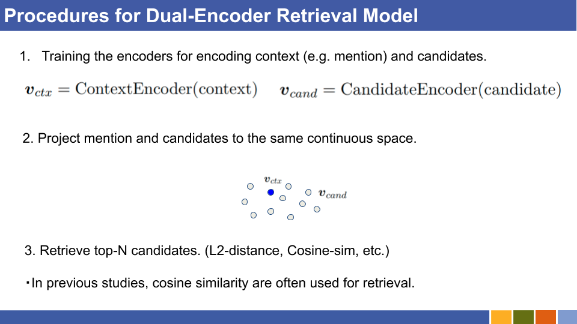

# Dual-encoder-with-BERT
Re-implementation of [[Gillick et al., '19]](https://arxiv.org/abs/2004.03555) and [[Humeau et al., '20]](https://arxiv.org/abs/1905.01969) 's bi-encoder.

# Requirements
See `requirements.txt`.

Also, you need `cui2idx.json`, `idx2cui.json`, `cui2cano.json`, and `cui2def.json` for encoding entities of specified KB (, or, entity set).

* `cui2idx.json` and `idx2json` 

  cui means one unique id for each entity, like `D0002131` of `United stated of America` in DBpedia.
  
  idx is integer for each cui.
  
* `cui2cano.json` and `cui2def.json`

  Canonical names specify entity name for each entity. Canonical names and Definitions (first sentence of definition is often used here) must be split to tokens.

# How to run

* Prepare entities mentioned above, and linking dataset.

  * Linking evaluation is done with entire accuracy, not normalized one.

# LICENSE 
MIT
